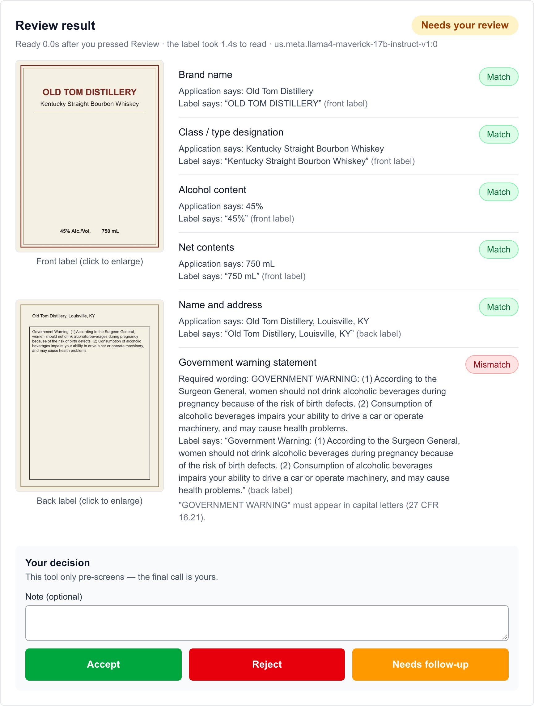
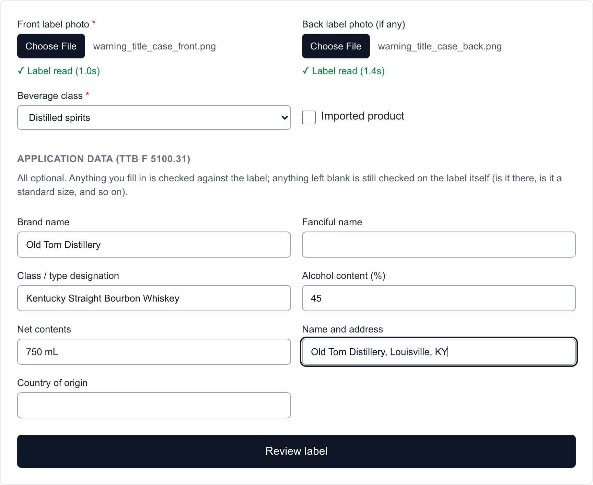

# TTB Label Review

An AI-assisted pre-screener for alcohol beverage labels. An agent uploads a photo of the label and, optionally, the values declared on the TTB F 5100.31 application (COLA). The tool reads what is printed on the label and checks each field against the application and against TTB's labeling rules: brand name, class/type, alcohol content and proof, net contents, name and address, country of origin for imports, and the Government Warning statement.

It is a **pre-screen only**: the agent makes every decision, and only TTB can approve a label.

**Live demo:** https://cola-demo.wjford.dev · **Author:** Wyatt Ford



## Using the demo

1. Under **Front label photo** (and **Back label photo**, if the product has one), choose the label images. Reading starts immediately. The TTB F 5100.31 PDF upload above the form is optional and only pre-fills the application fields.
2. Choose the **beverage class**, and tick **Imported product** if it applies.
3. Optionally fill in what the application declares. Anything left blank is still checked on the label itself.
4. Press **Review label.** Each field's verdict appears beside the label images, and the agent records **Accept**, **Reject** or **Needs follow-up**.

For many applications at once, **Review a batch** (top of the page) takes a folder of label photos plus a spreadsheet with one row per application; a template is provided on that page. Any photo of a bottle label works, and synthetic test labels can be generated with [`testing/generate_fixtures.py`](testing/README.md).



## Approach

- **The model reads; plain code decides.** An open-weight vision-language model transcribes each label image into structured fields. It never judges compliance. Every verdict comes from deterministic, unit-tested rules, so legally exact requirements never rest on a model's judgment.
- **One rule type per field:**
  - exact wording for the Government Warning, with "GOVERNMENT WARNING" in capitals;
  - a ±0.3-point tolerance for alcohol content, and proof equal to twice the alcohol content;
  - authorized container sizes for net contents;
  - case- and punctuation-insensitive matching for names, with near misses flagged rather than failed;
  - front-label placement for wine.
- **Reading starts at upload,** not at Review. A label image takes about 1.5 s to read, less time than it takes to type in the application, so pressing Review normally returns a result almost instantly.
- **Batches run on the server.** Hundreds of applications are validated in the browser before anything uploads, reviewed in the background, and triaged with the ones needing attention first. Single reviews always take priority over batch work.
- **An open-weight model, because of the firewall.** TTB's network blocks many external endpoints, so the model is one the agency could run in its own cloud account or on its own hardware. The demo uses Llama 4 Maverick on Amazon Bedrock; the same code also runs against a self-hosted model through Ollama.

## Tools used

| Area | Tools |
|---|---|
| Backend | Python 3.12, FastAPI, Pydantic, SQLAlchemy, SQLite, httpx |
| Frontend | Next.js (App Router), React, TypeScript, Tailwind CSS |
| Vision-language model | Llama 4 Maverick 17B on [Amazon Bedrock](https://aws.amazon.com/bedrock/); Qwen2.5-VL 7B on self-hosted [Ollama](https://ollama.com/). Both open-weight |
| Image and document handling | Pillow (photo normalization), pypdf (TTB F 5100.31 pre-fill) |
| Testing | pytest, Node's built-in test runner, and an end-to-end gauntlet of 43 rendered labels with known correct verdicts |
| Code quality | Ruff, ESLint, TypeScript type checking |
| Packaging and deployment | uv, npm, Docker Compose on a Linux VPS behind an HTTPS reverse proxy |

## Assumptions

- The tool pre-screens and the agent decides; nothing is approved or rejected automatically.
- Only beverage class and import status are required inputs. Class/type, alcohol content and net contents are not on TTB F 5100.31, so every declared field is optional.
- The Government Warning must match 27 CFR 16.21 word for word, punctuation included.
- Alcohol content may differ by ±0.3 percentage points between label and application, for every beverage class.
- Bold type, type size and contrast cannot be judged from a photo and are left to the agent.
- The 5-second target is measured from when the agent presses Review.
- A batch arrives as a folder of photos plus a spreadsheet; bulk-accepting results is a TTB policy decision, not a tool default.
- As a standalone proof of concept, it has no COLA integration and no login, and stores no sensitive data.

## Running locally

Requires Python 3.12+ with [uv](https://docs.astral.sh/uv/), Node.js 18+, and a model provider: either a Bedrock API key (`INFERENCE_PROVIDER=bedrock` and `BEDROCK_KEY` in `backend/.env`), or [Ollama](https://ollama.com/download) with `ollama pull qwen2.5vl`, which is the default.

Start the backend and the frontend in two terminals:

```bash
cd backend && uv sync && uv run uvicorn app.main:app --reload   # http://localhost:8000
cd frontend && npm install && npm run dev                        # http://localhost:3000
```

Tests run without a model, which is stubbed out: `uv run pytest` in `backend/` and `npm test` in `frontend/`. With Docker, `docker compose up -d --build` serves the whole app on port 3000.

## Known limitations

- **The model can misread.** Llama 4 Maverick passes 42 of the 43 gauntlet labels; the one miss flags a compliant wine for review, which is the safe direction to be wrong in. The label image is always shown beside the verdicts.
- **The rules simplify 27 CFR Parts 4, 5, 7 and 16.** Commodity-specific disclosures such as color additives are flagged for human review rather than checked by a dedicated rule.
- **Image handling covers rotation and size only.** Photos taken at an angle or with glare rely on the model's robustness.
- **Prototype infrastructure:** SQLite, no authentication, and background work in a single server process.

## More detail

[docs/technical-details.md](docs/technical-details.md) covers the rules with their regulation citations, the batch design, the reasoning behind the model choice, performance figures, deployment and security, the API, the project structure, and the reasoning behind each assumption and limitation.
